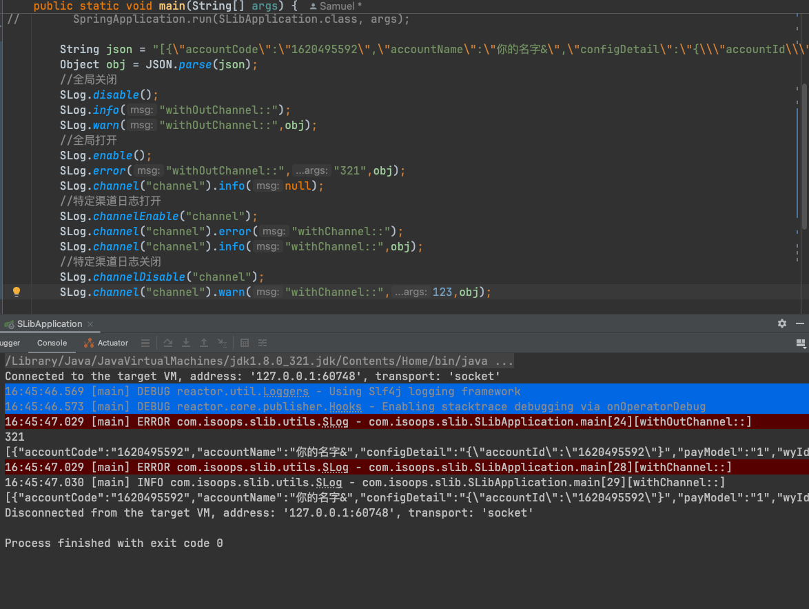
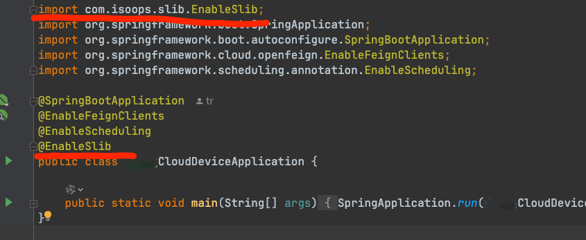
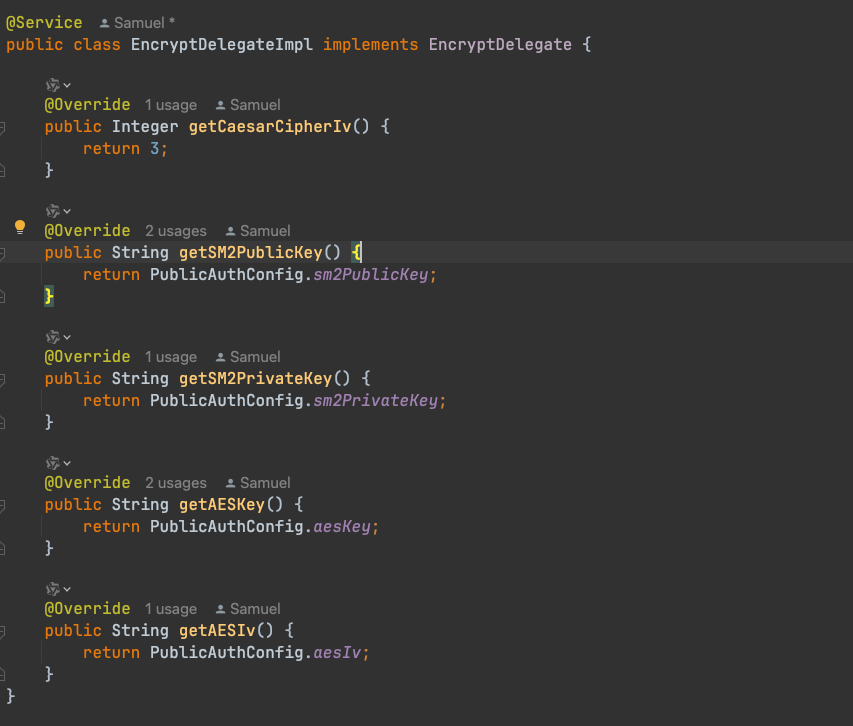
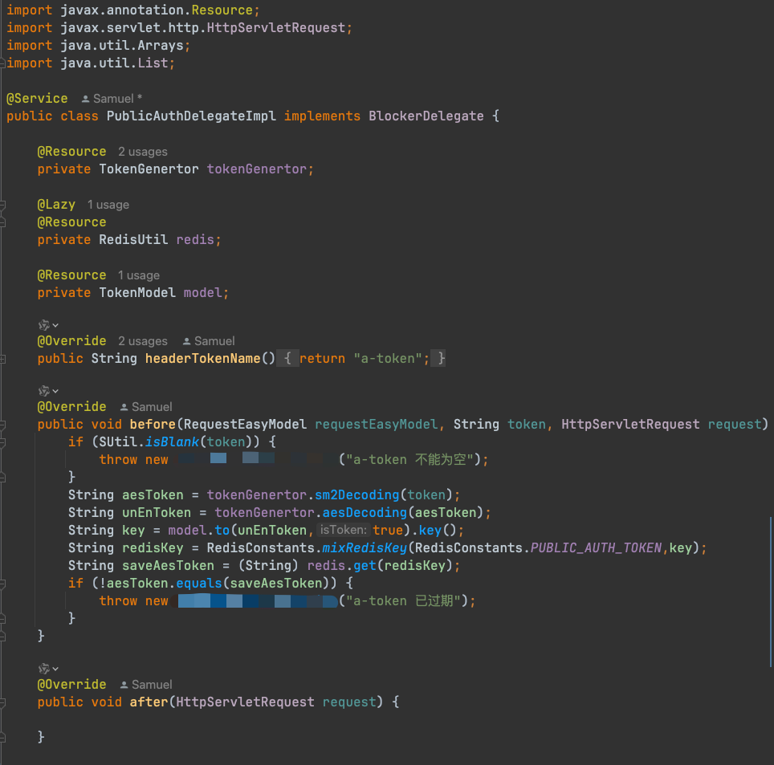
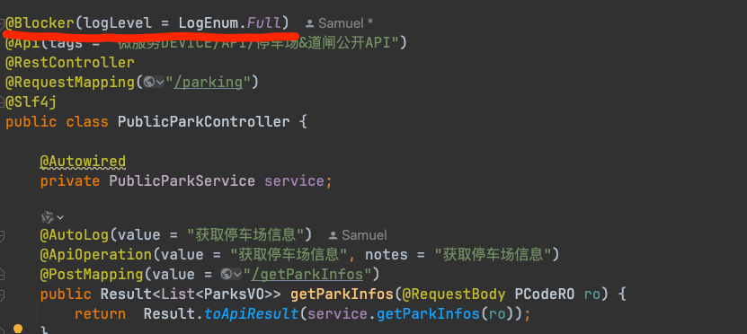
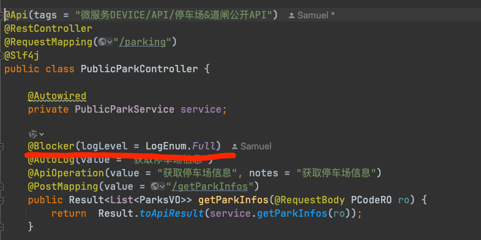

# Slib

#### 这是一个java开发工具包
#### SLib is a general lib for java development

***
#### Maven address

https://mvnrepository.com/artifact/com.isoops/SLib

*****
#### 包内容如下
``````
├── annotation    
│   ├── blocker
│   │   ├── Blocker.java                        自定义鉴权注解
│   │   ├── BlockerContract.java                /
│   │   ├── BlockerDelegate.java                自定义鉴权接口
│   │   └── BlockerDelegateDefaultImpl.java     /
│   ├── logger                                   
│   │   ├── LogEnum.java                        /
│   │   ├── Logger.java                         自定义日志注解
│   │   ├── LoggerContract.java                 /
│   │   └── LoggerFactory.java                  /
│   ├── BasicContract.java                      /
│   ├── ContractFacory.java                     /
│   └── RequestEasyModel.java                   /
├── common
│   ├── auth                
│   │   ├── AuthSingleton.java                  /
│   │   ├── SAuthService.java                   /
│   │   └── SAuthServiceImpl.java               /                      
│   ├── token
│   │   ├── TokenChannel.java                   /
│   │   ├── TokenGenertor.java                  /
│   │   └── TokenModel.java                     /
│   ├── SAliasBeanBasic.java                    /
│   ├── SBeanBasic.java                         /
│   └── SlibConfig.java                         /
├── pojo
│   ├── AbstractObject.java                     领域父类
│   ├── BeanCopierUtils.java                    对象复制工具
│   ├── CloneDirection.java                     领域复制方向类
│   ├── DomainType.java                         领域类型枚举
│   ├── IFunction.java                          自定义Function
│   └── SFieldAlias.java                        别名注解
├── redis                                
│   ├── RedisDelegate.java                      Redis实现接口
│   ├── RedisDelegateDefaultImpl.java           /
│   ├── SRedis.java                             Redis工具类
│   ├── SRedisMod.java                          RedisMod工具类
├── support
│   └── SuperDaoServiceImpl.java                Dao层自定义父类(基于MybatisPlus)
├── utils                                   
│   ├── encrypt                        
│   │   ├── EncryptDelegate.java                加密密钥接口
│   │   ├── EncryptDelegateDefaultImpl.java     /
│   │   └── SEncrypt.java                       对称加密工具 
│   ├──  SBeanUtil.java                         对象操作工具
│   ├──  SFieldUtil.java                        Class/Field/Lambok操作工具
│   ├──  SIdCardUtil.java                       身份证操作工具
│   ├──  SLog.java                              日志工具
│   └──  SUtil.java                             判断工具类
``````
***
## 使用教程
### SLog 教程


### 自定义鉴权使用
启动注入(使用代理接口必须)

配置密钥(非必要,存在默认值,建议配置)

配置鉴权失败代理

接口全局使用

接口局部使用

